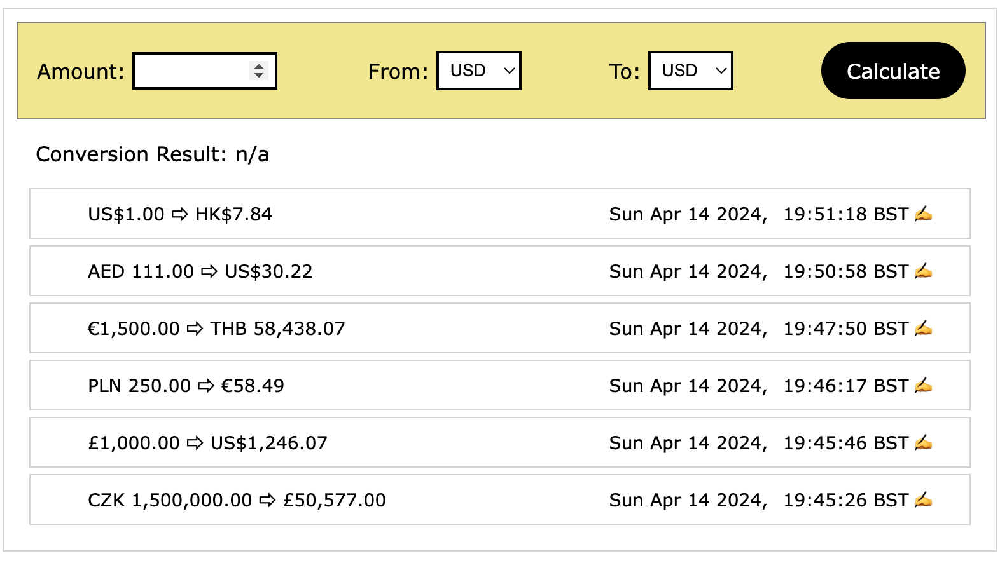

## Currency converter app (Vite+React-Express)

Initial set up with [Vite-express](https://github.com/szymmis/vite-express) `npx create-vite-express`

Clone project and install packages `npm i`

Run project `npm run dev`

Front end

- Visit [localhost:3000](http://localhost:3000/)

APIs

- List of currencies [`localhost:3000/currencies`](http://localhost:3000/currencies)
- Exchange rate for given currency [`localhost:3000/currencies/usd`](http://localhost:3000/currencies/usd) (ie USD)
- [`API source/documentation`](https://www.exchangerate-api.com/docs/free)

## Screenshot

